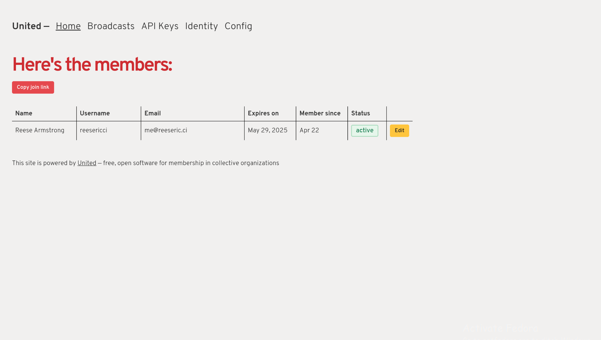

# United

Free and open membership software for collective organizations

## Deploying with Fly.io

1. Clone this repository to your computer
2. Make an account with [fly.io](https://fly.io)
3. Install the fly.io CLI
4. Run `fly login` in the terminal
5. Run `rails credentials:edit` then press (CTRL/CMD)+X to exit the nano editor
6. Run `fly launch`
7. Enjoy!

## Details

- SQLite Database (No external DB needed)

- Ruby 3.3.0

- Site configuration handled through initial wizard

## TODOS (Roadmap-ish)

TODO: Deploy to Heroku & Render buttons [ ]

TODO: Automated update system [ ]

TODO: Self-hosted deployment instructions [ ]

~~TODO: OIDC provider [X]~~

TODO: Verify emails [ ]

TODO: Unlimited membership length option [ ]

TODO: Make normal API OAuth-based to consolidate between OIDC Provider w/Doorkeeper and normal API [ ]

TODO: Warning emails for upcoming expirations, and allow for renewing of memberships (HIGH PRIORITY) [ ]

TODO: CSV export of membership (HIGH PRIORITY) [ ]

TODO: Triggers & Hooks [ ]

## Screenshot

## Copyright

Copyright (C) 2024 Software Freedom Conservancy and United contributors

This program is free software: you can redistribute it and/or modify it under the terms of the GNU Affero General Public License as published by the Free Software Foundation, either version 3 of the License, or (at your option) any later version.

This program is distributed in the hope that it will be useful, but WITHOUT ANY WARRANTY; without even the implied warranty of MERCHANTABILITY or FITNESS FOR A PARTICULAR PURPOSE. See the GNU Affero General Public License for more details.

You should have received a copy of the GNU Affero General Public License along with this program. If not, see https://www.gnu.org/licenses/.