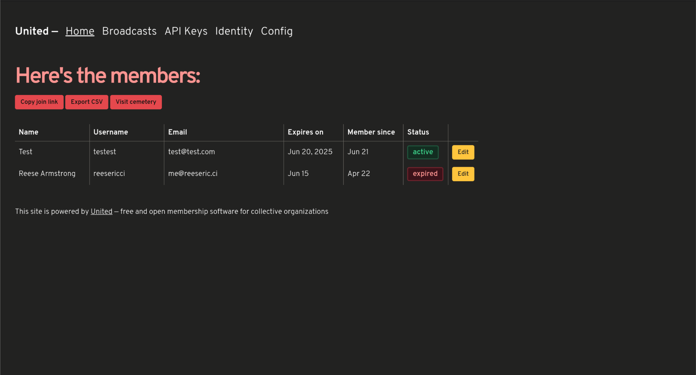
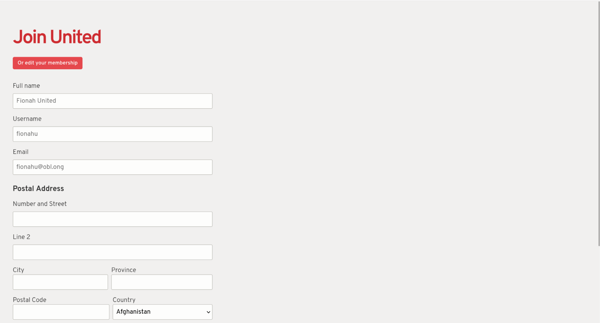

# United

United is free and open membership software for collective organizations, allowing robust tracking of membership, expirations, email broadcast tools, providing single-sign-on for your members, and more.

Copyright (C) 2024 [Software Freedom Conservancy](https://sfconservancy.org/assignment/90c1485a-f5ca-4b6c-ba1a-fded83d87cf3/) and United contributors

This program is free software: you can redistribute it and/or modify it under the terms of the GNU Affero General Public License as published by the Free Software Foundation, either version 3 of the License, or (at your option) any later version.

This program is distributed in the hope that it will be useful, but WITHOUT ANY WARRANTY; without even the implied warranty of MERCHANTABILITY or FITNESS FOR A PARTICULAR PURPOSE. See the GNU Affero General Public License for more details.

You should have received a copy of the GNU Affero General Public License along with this program. If not, see https://www.gnu.org/licenses/.

## Deploying with Fly.io

1. Clone this repository to your computer
2. Make an account with [fly.io](https://fly.io)
3. Install the fly.io CLI
4. Run `fly login` in the terminal
5. Run `rails credentials:edit` then press (CTRL/CMD)+X to exit the nano editor
6. Run `fly launch`
7. Enjoy!

## Details

- SQLite Database by default (No external DB required)
  - Optional PostgreSQL support available by setting the `DATABASE_URL` environment variable

- Ruby 3.3.2

- Site configuration handled through initial wizard

## TODOS (Roadmap-ish)

- [X] Deploy to Heroku & Render buttons
  - [X] Heroku
  - [X] Render

- [ ] Automated update system

- [ ] Self-hosted deployment instructions

- [X] OIDC provider

- [ ] Verify emails

- [ ] Unlimited membership length option

- [ ] Make normal API OAuth-based to consolidate between OIDC Provider w/Doorkeeper and normal API

- [ ] Warning emails for upcoming expirations, and allow for renewing of memberships (HIGH PRIORITY)

- [ ] CSV export of membership (HIGH PRIORITY)

- [ ] Triggers & Hooks

- [ ] Automated testing (RSpec)

- [X] Self-serve portal for editing membership data 

- [ ] Allow for fetching of identity login codes via TOTP app instead of email

- [ ] Easier SMTP setup/SMTP setup guidance with external provider (e.g. Postmark or SES)

- [ ] Approval queue for new members instead of automatic acceptance

- [ ] Surface errors to administrator via alerts (e.g. SMTP misconfiguration)

## Screenshots

